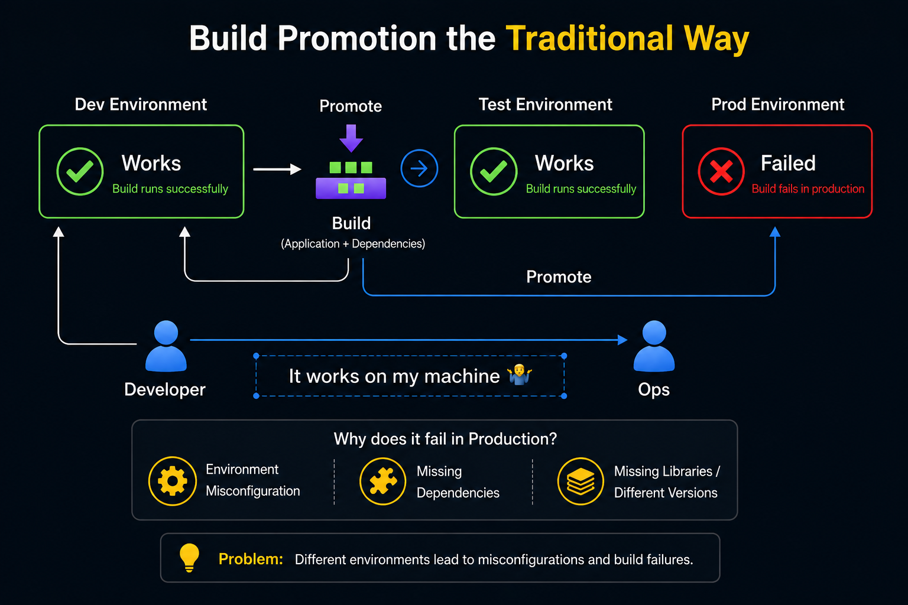
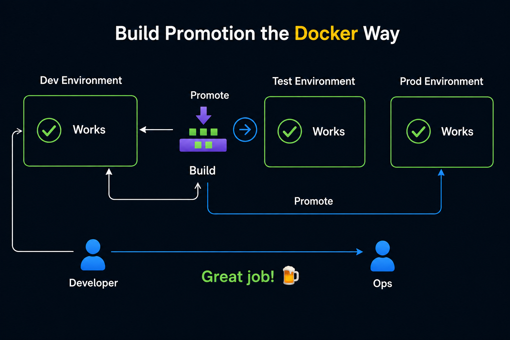
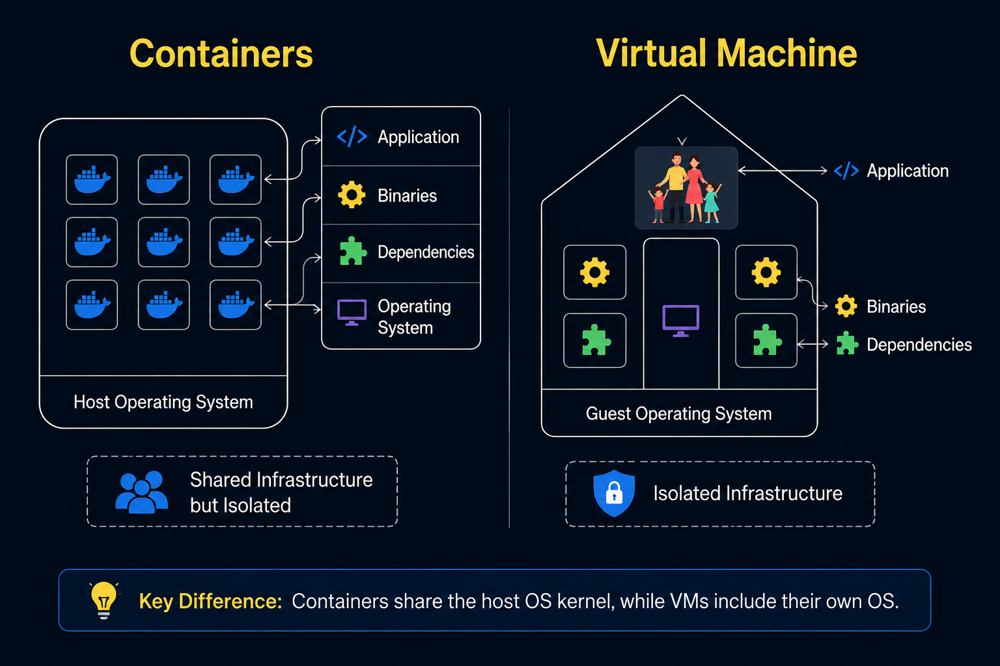
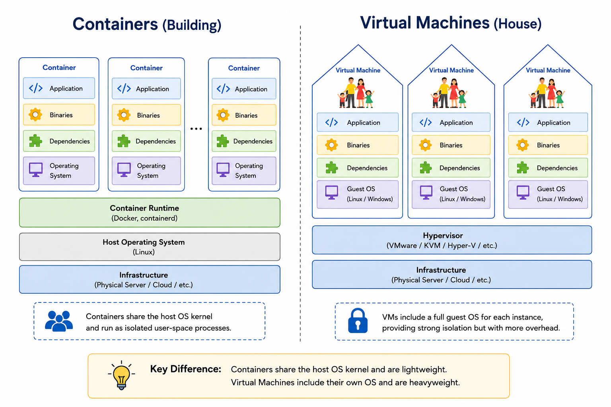
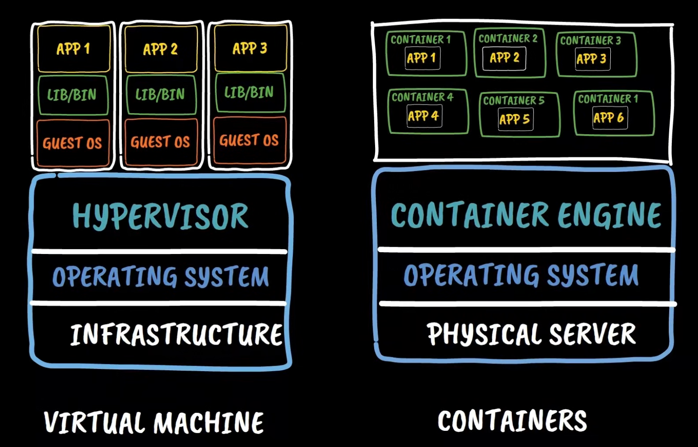
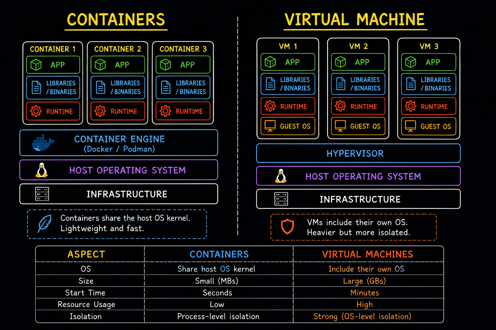
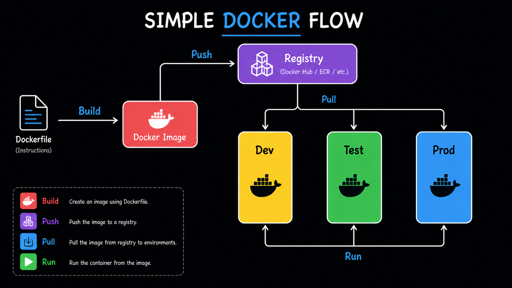
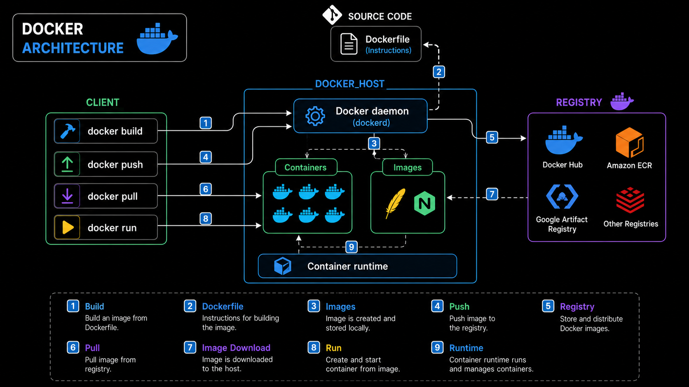

# Docker Fundamentals

## 1. Why Do We Need Containers?


Before containers, a common problem was **environment mismatch**.

An application may work correctly in **development and testing**, but fail when promoted to **production** because of:

1. Environment misconfiguration
2. Missing dependencies
3. Different libraries or versions
4. Differences between environments




This often leads to:

> **Developer:** "It works on my machine. Why is it not working in production?"

The problem is that application code alone is not always enough. The application also needs its **dependencies, libraries, runtime, and configuration**.

### Container Solution

Containers allow us to package the application together with everything required to run it:



```text
Application
+ Dependencies
+ Libraries
+ Runtime
+ Required OS packages
        ↓
    Container Image
        ↓
   Dev → Test → Prod
```

This makes environments much more consistent.

---

# 2. What is a Container?

A **container** is an isolated environment used to run an application with its required dependencies and runtime.

It can contain:

* Application code
* Runtime
* Libraries
* Dependencies
* Required OS packages

Containers are **lightweight** because they share the host OS kernel instead of carrying a complete guest OS like a VM.

### Main Goal of Containers

> **Build → Ship → Run**

### Docker

**Docker** is a platform used to build, ship, and run containers.

An alternative container platform is **Podman**.

---

# 3. Container vs Virtual Machine






### Analogy

* **VM → Independent house**
* **Container → Apartment**

An independent house has everything separately, while apartments share some common infrastructure.

### Virtual Machine

A VM is a software-based machine that allows multiple operating systems to run on a single physical machine.

Each VM has its own **guest OS**, providing strong isolation but requiring more resources.

### Container

A container runs as an isolated process while sharing the **host OS kernel**.

This makes containers generally:

* Faster to start
* More lightweight
* Less resource-intensive



---

# 4. Basic Architecture



## Physical Infrastructure Vs Container

### Infrastructure

Your physical machine. Either it sits somewhere in any data center or it can be your PC.

### Operating system
On top of **infrastructure, an OS lies.** That lets you interact with your physical machine. Such as Linux and Windows.


### Hypervisor

A **hypervisor** enables virtualization and allows multiple VMs to run on a single physical machine.

### Container Engine

A **container engine** allows multiple containers to run on a single OS kernel.

Docker uses components such as the **Docker Engine (`dockerd`)** to manage containers.

---

# 5. Docker Flow

Docker's basic workflow is:



### 1. Build

A `Dockerfile` contains instructions for building the application image.

```bash
docker build -t my-app .
```

### 2. Push

Push the image to a container registry such as **Docker Hub** or **Amazon ECR**.

```bash
docker push username/my-app:latest
```

### 3. Run

Pull the image and create a running container:

```bash
docker pull username/my-app:latest
docker run username/my-app:latest
```

---

# 6. Docker Architecture

The important components are:

### Dockerfile

A text file containing instructions required to build a Docker image.

Example:

```dockerfile
FROM node:18-alpine
WORKDIR /app
COPY . .
RUN yarn install --production
CMD ["node", "src/index.js"]
```

### Docker Client

The CLI through which we interact with Docker:

```bash
docker build
docker push
docker pull
docker run
```

### Docker Daemon — `dockerd`

The Docker daemon receives requests from the Docker client and performs operations such as:

* Building images
* Pulling images
* Pushing images
* Creating containers
* Starting containers

### Docker Image

A **read-only template/package** containing everything required to create a container.

### Container Registry

A repository for storing and distributing Docker images.

Examples:

* Docker Hub
* Amazon ECR
* Google Artifact Registry

---

## Docker Command Flow

```text
docker build
      ↓
 Docker Client
      ↓
   dockerd
      ↓
 Docker Image
      ↓
docker push
      ↓
 Container Registry
      ↓
docker pull
      ↓
   dockerd
      ↓
 Docker Image
      ↓
docker run
      ↓
 Container
      ↓
 Application
```

### Key Concept to Remember

> **Dockerfile → Image → Registry → Container**

And the overall purpose is:

> **Build once → Ship the same image → Run consistently across environments**
