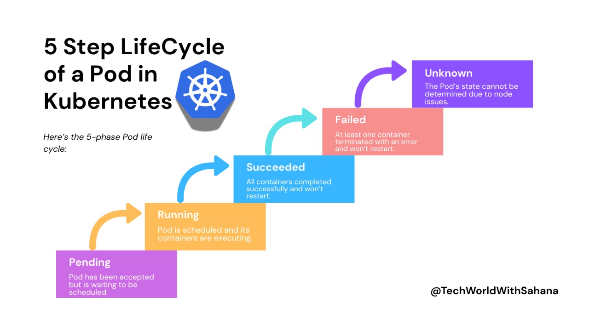

# Kubernetes Pods: Imperative & Declarative Approach

## Objective

Learn how to:

* Create a Pod using **imperative** and **declarative** methods
* Generate YAML using `--dry-run`
* Understand basic Pod YAML structure
* Troubleshoot Pod creation errors
* Inspect Pod labels and status
* Understand common `ImagePullBackOff` issues

---

# 1. Imperative vs Declarative

### Imperative

Tell Kubernetes **what command to execute**.

```bash
kubectl run nginx-imp --image=nginx:latest
```

Verify:

```bash
kubectl get pods
```

### Declarative

Define the **desired state in YAML** and apply it.

```yaml
apiVersion: v1
kind: Pod

metadata:
  name: nginx-pod
  labels:
    env: demo
    type: frontend

spec:
  containers:
    - name: nginx-container
      image: nginx
      ports:
        - containerPort: 80
```

Apply:

```bash
kubectl apply -f pod.yaml
```

Verify:

```bash
kubectl get pod nginx-pod
```

### Simple difference

```text
Imperative
    ↓
kubectl command
    ↓
Kubernetes

Declarative
    ↓
YAML
    ↓
kubectl apply
    ↓
Kubernetes
```

---

# 2. Basic Kubernetes YAML Structure

For most Kubernetes resources, remember these four top-level fields:

| Field        | Purpose                         |
| ------------ | ------------------------------- |
| `apiVersion` | Kubernetes API version          |
| `kind`       | Resource type                   |
| `metadata`   | Name, labels, annotations, etc. |
| `spec`       | Desired configuration           |

Example:

```yaml
apiVersion: v1
kind: Pod

metadata:
  name: nginx-pod

spec:
  containers:
    - name: nginx
      image: nginx
```

> **CKA tip:** `apiVersion`, `kind`, `metadata`, and `spec` are the important structural fields to recognize. Not every Kubernetes resource uses exactly the same fields underneath them.

---

# 3. Generate YAML with Dry Run

Instead of manually writing YAML, generate it using:

```bash
kubectl run nginx \
  --image=nginx \
  --dry-run=client \
  -o yaml
```

### What does `--dry-run=client` do?

It asks `kubectl` to **generate/validate the object locally without creating it in the cluster**.

This is extremely useful during the CKA exam.

### Save the YAML to a file

```bash
kubectl run nginx \
  --image=nginx \
  --dry-run=client \
  -o yaml > new-pod.yaml
```

Then inspect:

```bash
cat new-pod.yaml
```

Create the Pod:

```bash
kubectl apply -f new-pod.yaml
```

> **Important correction:** `--dry-run=client` does **not** create the Pod. Remove `--dry-run=client` if you actually want to create it.

---

# 4. Generate JSON

You can also generate JSON:

```bash
kubectl run nginx \
  --image=nginx \
  --dry-run=client \
  -o json > new-pod.json
```

Useful output formats include:

```bash
-o yaml
-o json
-o wide
```

---

# 5. Inspect a Pod

There are 5 Life Cycle status of Pod



### Basic status

```bash
kubectl get pods
```

### Detailed information

```bash
kubectl describe pod nginx-pod
```

`describe` is one of the most important troubleshooting commands.

Look especially at:

```text
Events:
```

because Kubernetes often tells you **why** the Pod failed.

### View Pod YAML

```bash
kubectl get pod nginx-pod -o yaml
```

---

# 6. Updating a Pod

A common mistake is trying to change the Pod's name after creation.

### Pod names cannot be changed

A Pod's `metadata.name` is effectively **immutable** after creation.

You cannot do:

```bash
kubectl edit pod nginx-pod
```

and rename it to:

```text
nginx-new
```

Instead:

```text
Existing Pod
    ↓
Delete
    ↓
Create new Pod
    ↓
New name
```

### Quickest approach

```bash
kubectl run nginx-new --image=nginx
```

Then:

```bash
kubectl delete pod nginx-pod
```

### Generate a new YAML

```bash
kubectl run nginx-new \
  --image=nginx \
  --dry-run=client \
  -o yaml > nginx-new.yaml
```

Apply it:

```bash
kubectl apply -f nginx-new.yaml
```

Then remove the old Pod:

```bash
kubectl delete pod nginx-pod
```

> **CKA tip:** When a field is immutable, the usual solution is **delete and recreate** or modify the higher-level controller managing the Pod.

---

# 7. `kubectl edit` 

`kubectl edit` is useful for modifying **mutable fields**, but it does not allow you to change immutable fields such as the Pod's name.

Example:

```bash
kubectl edit pod nginx-pod
```

Use it carefully.

For troubleshooting, prefer:

```bash
kubectl describe pod nginx-pod
kubectl get pod nginx-pod -o yaml
kubectl logs nginx-pod
```

---

# 8. Labels

Labels are key-value pairs attached to Kubernetes objects.

Example:

```yaml
labels:
  env: demo
  type: frontend
```

View labels:

```bash
kubectl get pods --show-labels
```

For a specific Pod:

```bash
kubectl get pod nginx-pod --show-labels
```

Filter using a label:

```bash
kubectl get pods -l env=demo
```

This becomes very important when working with **Services, Deployments, and selectors**.

---

# 9. `ImagePullBackOff`

### What does it mean?

`ImagePullBackOff` means Kubernetes **could not pull the container image** and is backing off before trying again.

Typical causes:

* Incorrect image name
* Incorrect repository
* Non-existent tag
* Private registry authentication failure
* Registry/network problems

Example:

```bash
kubectl run nginx-test --image=nginx123
```

Check:

```bash
kubectl get pods
```

You may see:

```text
nginx-test   0/1   ImagePullBackOff
```

Troubleshoot:

```bash
kubectl describe pod nginx-test
```

Check the **Events** section.

You may see an error similar to:

```text
Failed to pull image "nginx123"
```

### Fix

Use a valid image:

```bash
kubectl delete pod nginx-test

kubectl run nginx-test --image=nginx
```

Verify:

```bash
kubectl get pods
```

Expected:

```text
nginx-test   1/1   Running
```

---


# 10. Troubleshooting Flow

For a Pod that is not running, follow this sequence:

```text
kubectl get pods
       ↓
kubectl describe pod <pod>
       ↓
Check Events
       ↓
Identify the cause
       ↓
kubectl get pod <pod> -o yaml
       ↓
Fix / recreate if required
       ↓
kubectl get pods
```

For application-level problems, also check:

```bash
kubectl logs <pod-name>

kubectl logs <pod-name> --previous
```

---

