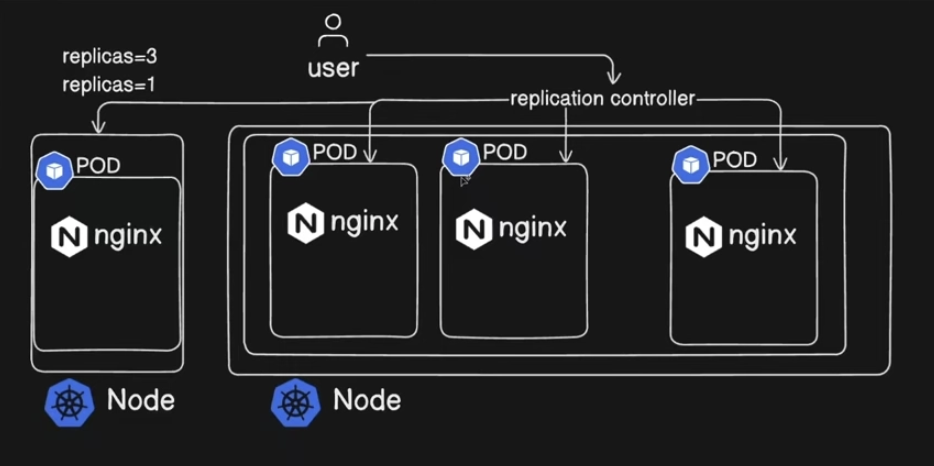
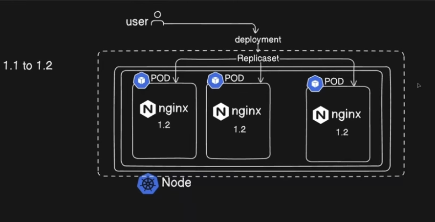

# ReplicationController, ReplicaSet & Deployment

## 🎯 Objective

* Understand **ReplicationController, ReplicaSet, and Deployment**.
* Learn how **Labels and Selectors** connect controllers with Pods.
* Create and manage **ReplicaControllers, ReplicaSets, and Deployments**.
* Practice **scaling Pods** using ReplicaSets and Deployments.
* Understand **Rolling Updates and Rollbacks** with Deployments.
* Learn to **update container images** and monitor rollouts.
* Practice generating Kubernetes YAML using **`--dry-run=client`**.
* Troubleshoot common issues using **labels, selectors, events, and `kubectl describe`**.


## 1. Core Concept

> **Labels identify Pods.**
> **Selectors find Pods.**
> **Controllers maintain the desired state.**

```text
Deployment
    ↓
ReplicaSet
    ↓
Pods
```

### Quick Comparison

| Feature           | ReplicationController | ReplicaSet                       | Deployment |
| ----------------- | --------------------- | -------------------------------- | ---------- |
| Maintain replicas | ✅                     | ✅                                | ✅          |
| Self-healing      | ✅                     | ✅                                | ✅          |
| Label selector    | Basic                 | Advanced                         | Advanced   |
| Scaling           | ✅                     | ✅                                | ✅          |
| Rolling updates   | ❌                     | ❌                                | ✅          |
| Rollback          | ❌                     | ❌                                | ✅          |
| Recommended       | ❌ Legacy              | ⚠️ Usually managed by Deployment | ✅ Yes      |

> **CKA:** In normal Kubernetes applications, use a **Deployment** rather than creating a ReplicaSet or ReplicationController directly.

---

# 2. ReplicationController (RC)

A **ReplicationController** ensures that the desired number of Pods are running.



For example:

```yaml
replicas: 3
```

If one Pod fails, the RC creates another Pod to maintain three replicas.

---

## RC YAML

```yaml
apiVersion: v1
kind: ReplicationController

metadata:
  name: nginx-rc

spec:
  replicas: 3

  selector:
    app: nginx

  template:
    metadata:
      labels:
        app: nginx

    spec:
      containers:
        - name: nginx
          image: nginx
          ports:
            - containerPort: 80
```

### Important

There are **two `spec` sections**:

```text
RC spec
 ├── replicas
 ├── selector
 └── template
       ├── metadata
       └── spec → Pod specification
```

The `template` defines the Pods that the RC creates.

---

## Create & Verify

```bash
kubectl apply -f rc.yaml

kubectl get rc
kubectl get pods
kubectl get pods --show-labels
```

Check details:

```bash
kubectl describe rc nginx-rc
```

---

## Delete RC

```bash
kubectl delete rc nginx-rc
```

By default, the RC and its managed Pods are deleted.

To delete only the RC while keeping its Pods:

```bash
kubectl delete rc nginx-rc --cascade=orphan
```

> The orphaned Pods will continue running, but they are no longer managed by the RC.

---

# 3. ReplicaSet (RS)

**ReplicaSet is the newer replacement for ReplicationController.**

It provides:

* Desired replica count
* Self-healing
* Scaling
* More expressive selectors

### Key Difference

ReplicaSets use:

```yaml
selector:
  matchLabels:
    app: nginx
```

This allows the ReplicaSet to select existing Pods whose labels match the selector.

### Important Concept

A ReplicaSet does **not** fundamentally care who originally created a Pod. It uses its **selector** to determine which Pods it manages.

However, in normal usage, avoid overlapping selectors because multiple controllers managing the same Pods can cause unexpected behavior.

---

# 4. ReplicaSet Implementation

```yaml
apiVersion: apps/v1
kind: ReplicaSet

metadata:
  name: nginx-rs

spec:
  replicas: 3

  selector:
    matchLabels:
      app: nginx

  template:
    metadata:
      labels:
        app: nginx

    spec:
      containers:
        - name: nginx
          image: nginx
          ports:
            - containerPort: 80
```

### Apply

```bash
kubectl apply -f rs.yaml
```

Verify:

```bash
kubectl get rs
kubectl get pods --show-labels
```

Check:

```bash
kubectl describe rs nginx-rs
```

---

# 5. ReplicaSet + Labels

The relationship is:

```text
ReplicaSet
    │
    │ selector: app=nginx
    ↓
┌───────────────┐
│ Pod           │
│ app=nginx     │ ← Managed
└───────────────┘

┌───────────────┐
│ Pod           │
│ app=nginx     │ ← Managed
└───────────────┘

┌───────────────┐
│ Pod           │
│ app=frontend  │ ← Not managed
└───────────────┘
```

### CKA Tip

When troubleshooting controllers:

```bash
kubectl get pods --show-labels
kubectl get rs
kubectl describe rs <rs-name>
```

Check whether **Pod labels match the controller selector**.

---

# 6. Scaling a ReplicaSet

### Imperative — fastest

```bash
kubectl scale rs nginx-rs --replicas=5
```

Verify:

```bash
kubectl get rs
kubectl get pods
```

### Edit the live object

```bash
kubectl edit rs nginx-rs
```

Change:

```yaml
spec:
  replicas: 5
```

> **CKA:** `kubectl scale` is usually faster when the question simply asks you to change the replica count.

---

# 7. Deployment

A **Deployment** manages ReplicaSets and provides application rollout capabilities.



```text
Deployment
     ↓
ReplicaSet
     ↓
Pods
```

### Why use Deployment?

Deployment provides:

* Scaling
* Self-healing through ReplicaSets
* Rolling updates
* Rollback
* Revision history

This makes Deployment the **standard choice for stateless applications**.

---

# 8. Create a Deployment

### Imperative

```bash
kubectl create deployment nginx --image=nginx
```

Scale:

```bash
kubectl scale deployment nginx --replicas=5
```

Verify:

```bash
kubectl get deployment
kubectl get rs
kubectl get pods
```

You should see:

```text
Deployment
    ↓
ReplicaSet
    ↓
5 Pods
```

---

# 9. Update the Container Image

First identify the container name:

```bash
kubectl get deployment nginx -o yaml
```

Then update:

```bash
kubectl set image deployment/nginx nginx=nginx:1.24
```

> The container name after `deployment/nginx` must match the actual container name in the Deployment.

Check rollout:

```bash
kubectl rollout status deployment/nginx
```

---

# 10. Rolling Update

When the Deployment image changes:

```text
Old ReplicaSet
      ↓
Old Pods
      ↓
New ReplicaSet created
      ↓
New Pods gradually created
      ↓
Old Pods gradually removed
```

This allows Kubernetes to perform a **rolling update** instead of replacing all Pods at once.

Check:

```bash
kubectl get rs
kubectl get pods
kubectl rollout status deployment/nginx
```

---

# 11. Rollout History

View revisions:

```bash
kubectl rollout history deployment/nginx
```

This shows the **revision numbers**, not necessarily the complete image information.

Inspect a specific revision:

```bash
kubectl rollout history deployment/nginx --revision=2
```

You can also inspect the ReplicaSets:

```bash
kubectl get rs
kubectl describe rs <replicaset-name>
```

> **Key concept:** Deployment revisions are represented by ReplicaSets.

---

# 12. Rollback

Rollback to the previous version:

```bash
kubectl rollout undo deployment/nginx
```

Rollback to a specific revision:

```bash
kubectl rollout undo deployment/nginx --to-revision=2
```

Verify:

```bash
kubectl rollout status deployment/nginx
kubectl get rs
```

---

# 13. Generate Deployment YAML

Use `--dry-run=client` to generate YAML without creating the Deployment:

```bash
kubectl create deployment nginx \
  --image=nginx \
  --dry-run=client \
  -o yaml > deployment.yaml
```

Inspect:

```bash
cat deployment.yaml
```

Apply:

```bash
kubectl apply -f deployment.yaml
```

---


