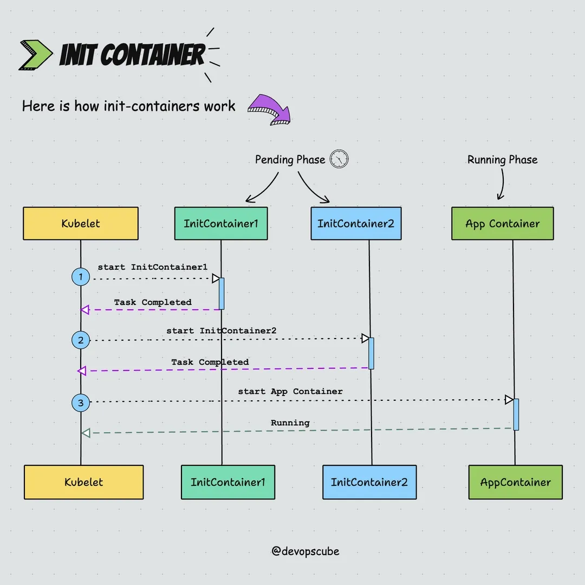
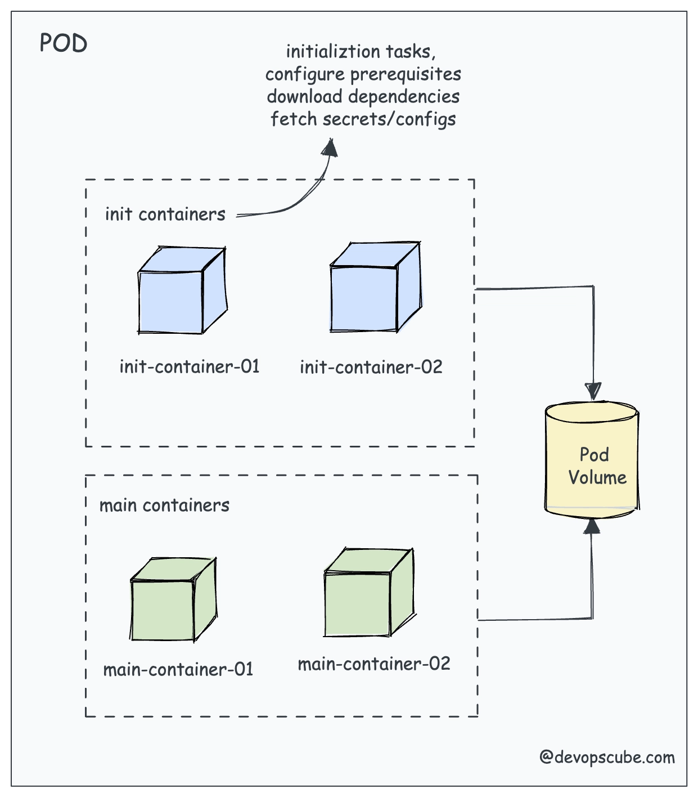
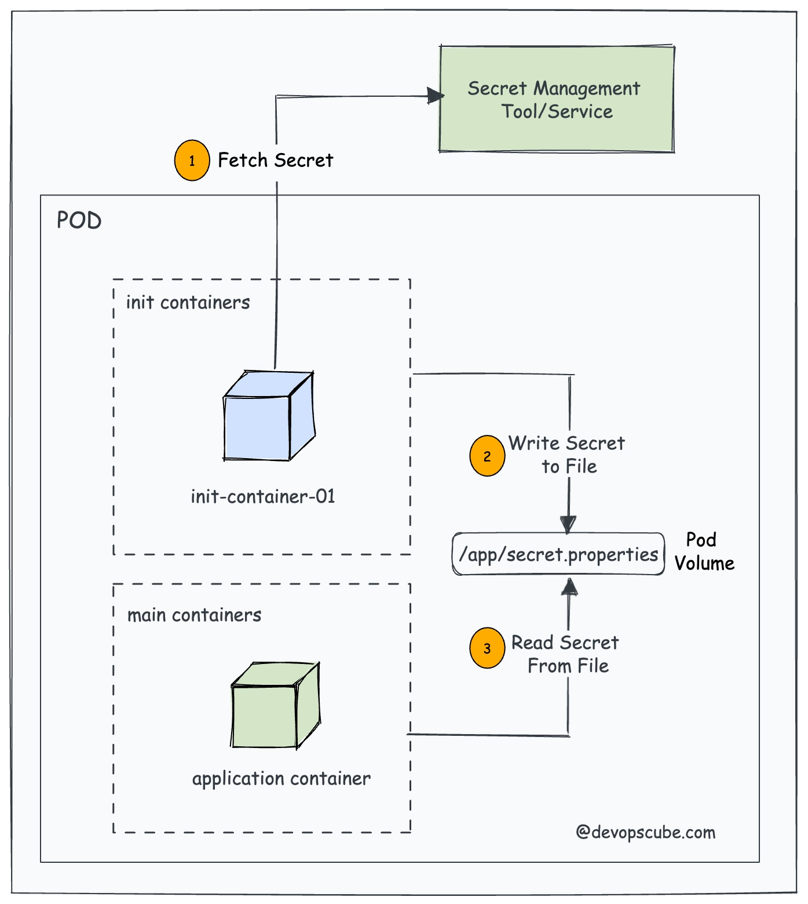

## Day 11 – Init Containers (Kubernetes)

### 🔹 What is an Init Container?

An **Init Container** in Kubernetes is a special container that **runs before the main container starts**.

👉 It is used to **prepare the environment** for your main application.

---

### 🔹 How it Works



Example 1

---
Example 2


---

1. Init container starts first
2. Completes its task
3. Then next init container (if any) runs
4. Finally → main container starts

📌 Important:

- If init container fails → Pod **won’t start**
- Runs **sequentially (one by one)**

---

### 🔹 Why Use Init Containers?

💡 Real-world use cases:

- Wait for a service (DB, API) to be ready
- Download config files / secrets
- Run database migrations
- Setup permissions
- Pre-load data

---

### 🔹 Example YAML

```yaml
apiVersion: v1
kind: Pod
metadata:
  name: init-demo
spec:
  initContainers:
  - name: init-myservice
    image: busybox
    command: ['sh', '-c', 'echo waiting... && sleep 5']

  containers:
  - name: main-app
    image: nginx
    ports:
    - containerPort: 80
```

---

### 🔹 Key Differences: Init vs Normal Container

| Feature | Init Container | Main Container |
| --- | --- | --- |
| Execution | Runs first | Runs after init |
| Lifecycle | Must complete | Runs continuously |
| Restart behavior | Retry until success | Follows pod policy |
| Purpose | Setup tasks | App logic |

---

### 🔹 Important Commands (CKA 🔥)

```bash
# Get pod details (see init container status)
kubectl get pod init-demo

# Describe pod (VERY IMPORTANT for exam)
kubectl describe pod init-demo

# Check logs of init container
kubectl logs init-demo -c init-myservice
```

---

### 🔹 Pro Tip (Exam + Real World)

👉 Most CKA questions test:

- Waiting for service using `nslookup` / `wget`
- Fixing broken init container
- Checking logs using `c`

---

### 🔹 Example (Wait for DB – Interview Level)

```yaml
initContainers:
- name: wait-for-db
  image: busybox
  command: ['sh', '-c', 'until nslookup mydb; do echo waiting for db; sleep 2; done']
```

---

### 🔹 One-Line Summary

👉 Init containers = **"Setup before app starts"**

---
