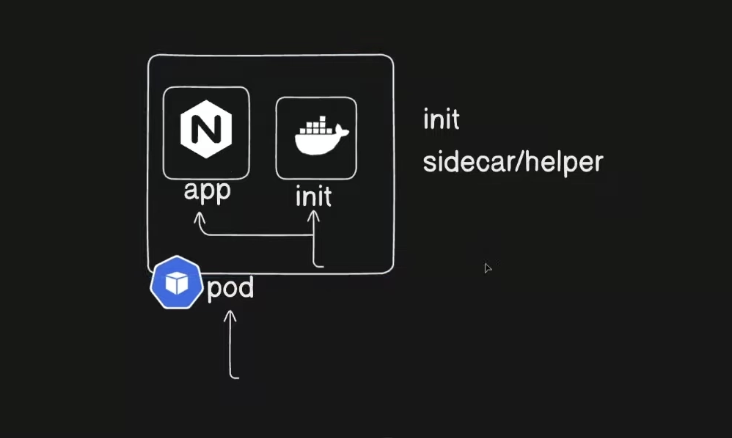

# Multi-Container Pods: 

1. Init Container  
2. Sidecar

## 🎯 Objective

* Understand **multi-container Pods**.
* Learn the difference between **Init Containers and Sidecar Containers**.
* Understand when to use each container type.
* Create a Pod with an **Init Container**.
* Practice multiple Init Containers and troubleshooting.

---



# 1. Init Container

An **Init Container** runs **before the application containers**.

It is used for tasks such as:

* Waiting for a dependency
* Preparing files/configuration
* Running initialization scripts
* Performing pre-start checks

### Key points

* Runs **before** app containers.
* Init containers run **sequentially**.
* The next Init Container starts only after the previous one completes successfully.
* The application containers start only after **all Init Containers complete successfully**.
* If an Init Container fails, Kubernetes retries it until it succeeds.

```text
Pod starts
    ↓
Init Container 1
    ↓
Init Container 2
    ↓
App Container
```

---

# 2. Sidecar Container

A **Sidecar Container** runs alongside the main application container and provides supporting functionality.

Common examples:

* Log collection
* Proxy
* Monitoring/metrics
* Configuration synchronization

```text
┌──────────────────────────────┐
│             Pod              │
│                              │
│  Main App  ←→  Sidecar       │
│                              │
└──────────────────────────────┘
```

### Important distinction

> **Init Container = setup before the app starts**
> **Sidecar = helper that runs with the app**

Containers in the same Pod share the Pod's:

* Network namespace
* Volumes
* Pod-level resources

> They do **not automatically share CPU/memory limits**. Resource requests/limits are configured per container and contribute to the Pod's scheduling/resource requirements.

---

# 3. Init Container — Implementation

Create `pod.yaml`:

```yaml
apiVersion: v1
kind: Pod

metadata:
  name: myapp
  labels:
    app: myapp

spec:
  initContainers:
    - name: init-myservice
      image: busybox:1.36
      command:
        - sh
        - -c
        - |
          until nslookup myservice.default.svc.cluster.local;
          do
            echo "Waiting for myservice..."
            sleep 2
          done

  containers:
    - name: myapp-container
      image: busybox:1.36
      command:
        - sh
        - -c
        - |
          echo "The app is running"
          echo "First name: $FIRST_NAME"
          sleep 3600
      env:
        - name: FIRST_NAME
          value: "Rahul"
```

Create the Pod:

```bash
kubectl apply -f pod.yaml
```

Check the Pod:

```bash
kubectl get pod myapp
kubectl describe pod myapp
```

Check Init Container status:

```bash
kubectl get pod myapp \
  -o jsonpath='{.status.initContainerStatuses[*].state}'
```

---

# 4. What is the Init Container Doing?

The Init Container waits for this Service:

```text
myservice.default.svc.cluster.local
```

It repeatedly runs:

```bash
nslookup myservice.default.svc.cluster.local
```

until DNS resolution succeeds.

```text
Pod starts
    ↓
Init Container
    ↓
Is myservice resolvable?
    │
    ├── No → wait 2 seconds → retry
    │
    └── Yes
          ↓
      Init completes
          ↓
      App Container starts
```

### Create the Service

For the demo, create a Service named `myservice`:

```bash
kubectl create service clusterip myservice --tcp=80:80
```

Then check:

```bash
kubectl get svc myservice
kubectl get pod myapp
```

Once the Init Container completes, the application container can start.

> **Important:** `nslookup` checks DNS resolution. It does **not** prove that the application behind the Service is healthy.

---

# 5. Check Application Logs

```bash
kubectl logs myapp -c myapp-container
```

Expected:

```text
The app is running
First name: Rahul
```

---

# 6. Multiple Init Containers

A Pod can have multiple Init Containers.

They execute **one after another**:

```text
Init Container 1
       ↓
Init Container 2
       ↓
Init Container 3
       ↓
Main Application
```

Example:

```yaml
spec:
  initContainers:
    - name: init-config
      image: busybox:1.36
      command: ["sh", "-c", "echo Preparing config"]

    - name: init-check
      image: busybox:1.36
      command: ["sh", "-c", "echo Checking dependency"]

  containers:
    - name: app
      image: nginx
```

The app starts only after **both Init Containers complete successfully**.

---

# 7. Troubleshooting

Check overall status:

```bash
kubectl get pod myapp
```

If the Pod is stuck in:

```text
Init:0/1
```

or:

```text
Init:1/2
```

check:

```bash
kubectl describe pod myapp
```

Check Init Container logs:

```bash
kubectl logs myapp -c init-myservice
```

### Common causes

* Service does not exist.
* Service name is incorrect.
* Namespace is incorrect.
* DNS resolution is failing.
* Init Container command is incorrect.

---

# 8. CrashLoopBackOff

A container can enter `CrashLoopBackOff` when its process repeatedly starts and exits.

For example:

```bash
kubectl run test --image=busybox
```

may exit immediately because the container has no long-running process.

For a lab container that needs to stay alive:

```yaml
command:
  - sh
  - -c
  - sleep 3600
```

> **Do not confuse this with Init Container behavior:** an Init Container is expected to **complete and exit successfully**. An application container normally needs to keep its main process running.

---


