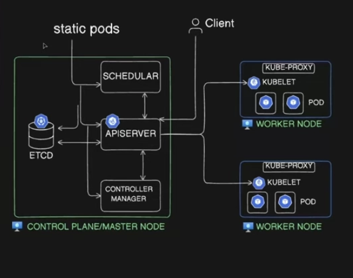
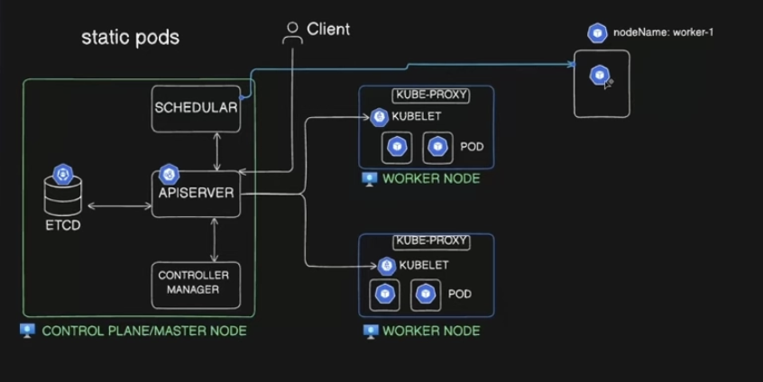

# Scheduler, Static Pods, Labels, Selectors & Annotations

## 🎯 Objective

* Understand the role of the **Kubernetes Scheduler**.
* Understand **Static Pods** and how they are managed.
* Learn **manual scheduling** using `nodeName`.
* Understand **Labels and Selectors**.
* Learn the difference between **Labels, Annotations, and Namespaces**.
* Practice scheduling and resource selection with `kubectl`.

---

# 1. Importance of the Scheduler

The **Kubernetes Scheduler** decides **which Node should run a newly created Pod**.

Basic flow:

```text
Pod created
    ↓
Scheduler
    ↓
Select suitable Node
    ↓
Pod scheduled
    ↓
Kubelet starts the Pod
```

The Scheduler considers factors such as:

* Available resources
* Node selectors/affinity
* Taints and tolerations
* Other scheduling constraints

> **Memory:**
> **Scheduler → Decides WHERE the Pod runs**
> **Kubelet → Runs the Pod on the selected Node**

---

# 2. Static Pods

A **Static Pod** is managed directly by the **Kubelet**, not by the Kubernetes Scheduler.



Static Pod manifests are normally stored in:

```text
/etc/kubernetes/manifests/
```

The Kubelet continuously watches this directory.

```text
Static Pod YAML
      ↓
/etc/kubernetes/manifests/
      ↓
Kubelet detects it
      ↓
Kubelet creates/runs Pod
```

### Control-plane example

In kubeadm clusters, components such as:

```text
kube-apiserver
kube-controller-manager
kube-scheduler
etcd
```

are commonly run as Static Pods.

> **Important:**
> Static Pods are **not responsible for scheduling the Scheduler Pod**. The **Kubelet** manages Static Pods directly, so the Scheduler does not schedule them.

---

# 3. Manual Scheduling

Normally, a Pod without a `nodeName` is handled by the Scheduler.



You can manually assign a Pod to a Node using:

```yaml
spec:
  nodeName: worker-1
```

Example:

```yaml
apiVersion: v1
kind: Pod
metadata:
  name: nginx
spec:
  nodeName: worker-1
  containers:
    - name: nginx
      image: nginx
```

Create it:

```bash
kubectl apply -f pod.yaml
```

Verify:

```bash
kubectl get pod nginx -o wide
```

You should see:

```text
NODE
worker-1
```

### 🧠 Recall

```text
No nodeName → Scheduler decides
nodeName set → Scheduler is bypassed
```

---

# 4. Labels

**Labels are key-value pairs attached to Kubernetes resources.**

They are mainly used to **identify, organize, and select resources**.

Example:

```yaml
metadata:
  labels:
    app: nginx
    env: dev
```

You can apply multiple labels to a resource.

Labels are commonly used with:

* Pods
* Deployments
* Services
* ReplicaSets
* DaemonSets

### View labels

```bash
kubectl get pods --show-labels
```

Filter using a label:

```bash
kubectl get pods -l app=nginx
```

---

# 5. Selectors

A **Selector selects resources based on their labels**.

Example:

```yaml
selector:
  matchLabels:
    app: nginx
```

This means:

```text
Selector: app=nginx
       ↓
Find Pods with:
app=nginx
```

Controllers such as Deployments, ReplicaSets, and DaemonSets use selectors to identify the Pods they manage.

Services also use selectors to identify backend Pods.

### 🧠 Recall

> **Label = Identity/Tag**
> **Selector = Matching mechanism**

```text
Pod
labels:
  app: nginx

        ↑ matches ↓

Selector:
  app: nginx
```

---

# 6. Labels — Practical Implementation

Create a Pod:

```bash
kubectl run nginx --image=nginx --labels="app=web,env=dev"
```

View labels:

```bash
kubectl get pods --show-labels
```

Select by label:

```bash
kubectl get pods -l app=web
kubectl get pods -l env=dev
```

Add a label to an existing resource:

```bash
kubectl label pod nginx team=backend
```

Verify:

```bash
kubectl get pod nginx --show-labels
```

---

# 7. Annotations

**Annotations store additional metadata about a Kubernetes resource.**

Unlike Labels, annotations are **not intended for selecting resources**.

Example:

```yaml
metadata:
  annotations:
    description: "Frontend application"
    owner: "devops-team"
```

Common uses:

* Tool/controller metadata
* Configuration information
* Build or deployment information
* Operational notes

### Label vs Annotation

| Labels                      | Annotations                           |
| --------------------------- | ------------------------------------- |
| Used for identification     | Used for additional metadata          |
| Used by selectors           | Not used by selectors                 |
| Usually small/simple values | Can contain larger/more detailed data |

> **Memory:**
> **Label → Select**
> **Annotation → Describe**

---

# 8. Namespace vs Labels

| Namespace                                        | Labels                                   |
| ------------------------------------------------ | ---------------------------------------- |
| Logical boundary for resources                   | Key-value tags                           |
| Helps organize/isolate resources                 | Helps identify/select resources          |
| Example: `dev`, `prod`                           | Example: `app=nginx`                     |
| Access control and quotas can be namespace-based | Used heavily by controllers and Services |

Example:

```text
Namespace: production

    ├── Pod
    │    └── app=frontend
    │
    ├── Pod
    │    └── app=backend
    │
    └── Service
         └── selector: app=backend
```

### 🧠 Final Recall

```text
Namespace   → WHERE resources are separated
Label       → WHAT resource is tagged as
Selector    → WHICH resources to select
Annotation  → EXTRA information about resource
Scheduler   → WHERE a Pod should run
Kubelet     → Runs the Pod
Static Pod  → Kubelet-managed Pod
```
